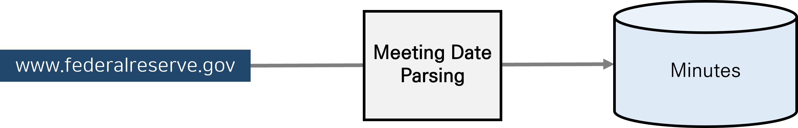
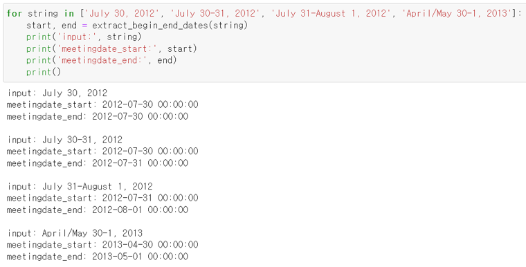

# Collecting FOMC Minutes

* For additional information, please contact us using the email addresses provided below.
    - sophia.jihyeparkk@gmail.com
    - hjkim@bdai.snu.ac.kr

* Reference
    - Scraping: https://github.com/tengtengtengteng/Webscraping-FOMC-Statements
    - Data source: https://www.federalreserve.gov/monetarypolicy/materials/

## Overview

### Input
| Variable           | Type | Example                                                             |
| :----------------- | :--- | :------------------------------------------------------------------ |
| start\_mmddyyyy    | str  | "01/01/1990"                                                        |
| end\_mmddyyyy      | str  | "08/22/2023"                                                        |
| chromedriver\_filepath | str  | "C:\\GIT\\SELENIUM\_DRIVERS\\chromedriver\_win32\\chromedriver.exe" |
| save\_temp\_dir    | str  | "./Temp"                                                      |

## Meeting date parsing

* Customized function: extract_begin_end_dates() 
    - Input: `date range (Data type: string)` in various formats
    - Output: `meetingdate_start (Data type: datetime)`, `meetingdate_end (Data type: datetime)` 

## Error Handling
* If an error occurs, the case is saved in the `ScrapingErrors.csv` file.
* After checking this file, handle the errors one by one.
